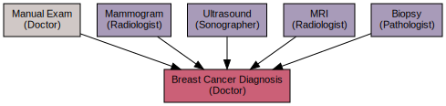

# The Scancer breast cancer detection API and model store

[Scancer](https://scancer.org/) is a web application that uses
computer vision to assist with varying stages of breast cancer
detection. At its core is a collection of learnt detection models (in
[PyTorch](https://pytorch.org)) that are served as an API (using
[TorchServe](https://pytorch.org/serve/)).

The specific procedures that are used to diagnose breast cancer are
depicted in the following graphic, and the ones that would most
benefit from computer vision are denoted in purple. The Scancer
project aims to collect and use state-of-the-art models for each of
these.

You can find currently implemented models by browsing the list of
repositories under the [Scancer GitHub
Organisation](https://github.com/scancer-org/).

The documentation in this repository shows you:

1. [How to use these models for detection](docs/using.md)
2. [How to improve on existing models, or contribute new ones](docs/contributing.md)
3. [How to monitor the API in production](docs/monitoring.md)

Depending on your expertise and your goals, you will find different
sections of the documentation more or less relevant. If you are more
interested in how this API and model store are setup as part of the
entire stack, please refer instead to our [server setup
scripts](https://github.com/scancer-org/setup/).

## Copyright and license

Copyright (c) 2021 [Harish Narayanan](https://harishnarayanan.org) and
[Daniel Hen](https://www.linkedin.com/in/daniel-hen/).

This code is licenced under the MIT Licence. See
[LICENSE](https://github.com/scancer-org/api/blob/main/LICENSE) for
the full text of this licence.
